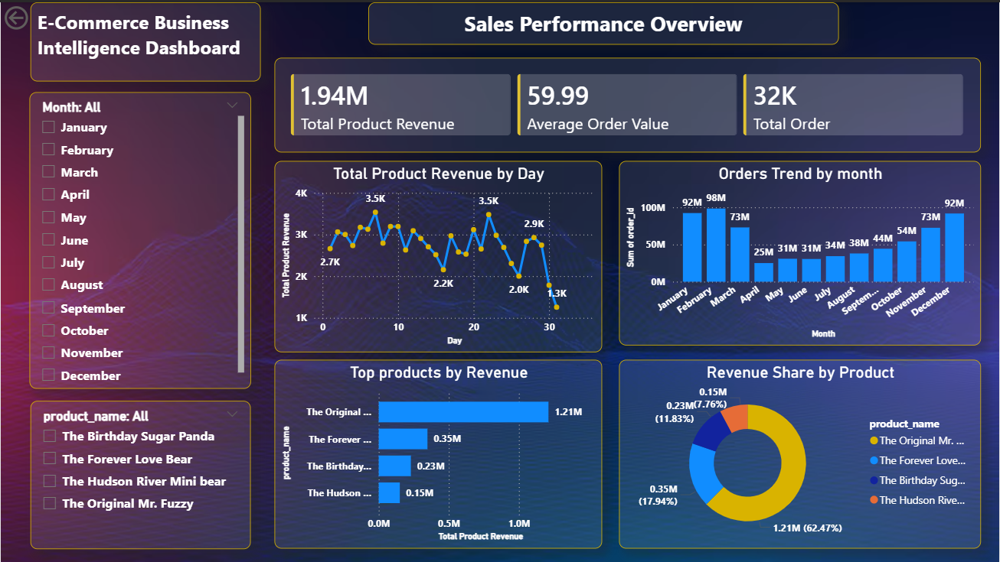
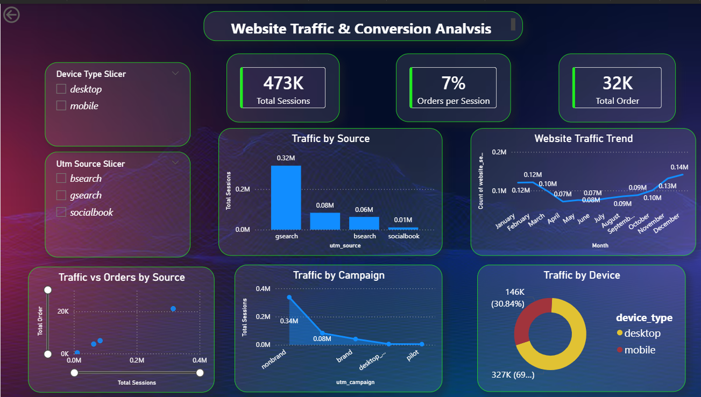

# 📊 Ecommerce Data Analytics Project

End-to-End **Ecommerce Data Analytics Project** built using **Python, SQL, and Power BI**.
This project demonstrates a complete data analytics workflow including **data cleaning, data analysis, and business dashboard visualization**.

## 🚀 Project Objective
The objective of this project is to analyze ecommerce business data to identify **sales trends, product performance, and website traffic insights** that help support data-driven business decisions.

## 🛠 Tools & Technologies
• Python (Pandas, NumPy)
• SQL (MySQL)
• Power BI
• GitHub

## 📂 Project Workflow
1. **Data Cleaning** using Python and Pandas
2. **Data Analysis** using SQL queries
3. **Data Visualization** using Power BI dashboards

## 📁 Repository Files

• `Data Cleaning.py.ipynb` → Python notebook for data cleaning
• `Data Analysis_SQL.sql` → SQL queries for business analysis
• `PowerBi_dashboard.pbix` → Interactive Power BI dashboard

## 📊 Dashboard Preview
### Sales Performance Overview

### Product Performance Analysis

### Website Analytics

## 📈 Key Insights
• Identified top-performing products by revenue
• Analyzed monthly sales trends
• Calculated product profit and profit margins
• Analyzed website traffic sources and device usage

## 📁 Project Structure
ecommerce-data-analytics-project
│
├── Data Cleaning.py.ipynb
├── Data Analysis_SQL.sql
├── PowerBi_dashboard.pbix
├── sales_dashboard.png
├── product_dashboard.png
├── website_dashboard.png
└── README.md

## 👨‍💻 Author

**Jatin Tanwani**
Aspiring Data Analyst | Python | SQL | Power BI
